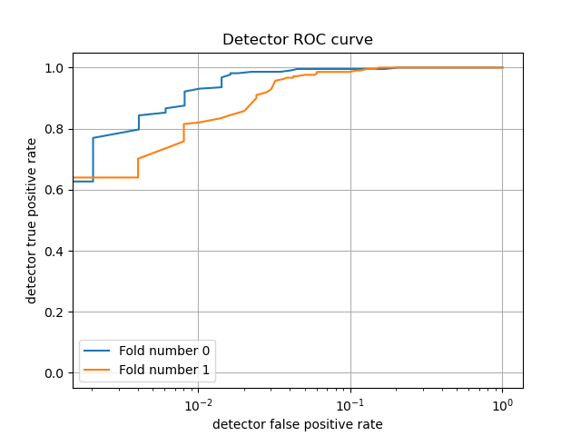
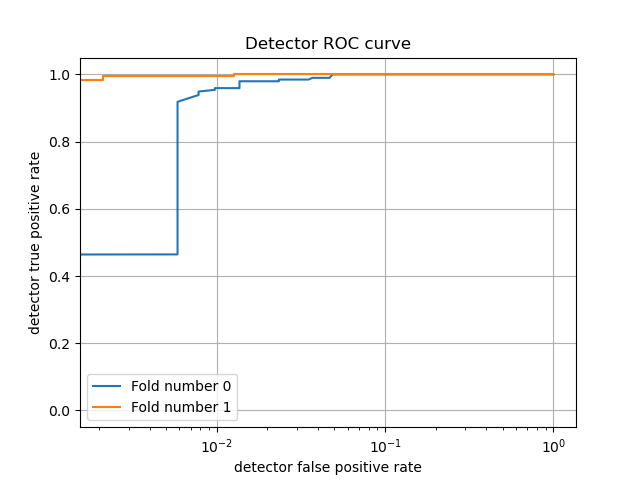

# sshwk1
ML Malware Detection 101 TEST 1

if you fork/clone, please give me a star.

Your approval is my motivation to improve this project.

# ML MALWARE DETECTION 101

Put this project in order to learn how to detect malware.

### Detecor_Strings

- Using Regex to get the strings of the file.
- Using the strings of the malware to detect the malware.

The length of the strings may be huge, so I use the FeatureHasher to hash the strings.

the proba I set is 0.75, which means the file may be a malware if the proba is bigger than 0.75.

### Detector_IAT
  - Extract the import address table from the malware.
  - Using the IAT to detect the malware.

The IAT of the malware also is not fixed.
Some of malware has not IAT.

the proba I set is 0.57.

### Detector_PEHeader

The first step is to get the PE header of the malware,
and then we can get the entry point of the malware.

I select DictVectorizer to transform the data into a vector.
the vector size (30) is the number of features.
some malware are not in the training set, which are not pe files.

the proba I set is 0.95.

## Results Proba
You can adjust the proba to get the best result.
`--evaluate` will show the figure of the model.

## Training Data
The Normal Data link:
[Normal Data Download](http://lemonoil.top:5333/s/plozwt)
The Datacon 2020 Data link:
Email to me. I will send you the link.

## TODO LIST 

- [x] Normal  Feature Test
- [ ] Datacon 2020 Review